# User Flows

This document maps the main user and system flows currently implemented in the Prebid Sales Agent codebase.

## Actors

- Publisher admin: signs up, configures a tenant, manages products, advertisers, settings, and approvals in the Admin UI
- Buyer or buyer agent: discovers inventory and creates or manages media buys over MCP, REST, or A2A
- Seller system: resolves auth and tenant context, executes shared business logic, and routes approval-dependent work into workflows
- Human reviewer: approves workflow steps and, when required, unblocks downstream media buy execution

## Product Surfaces

- Public web: signup and onboarding
- Admin UI: tenant dashboard, settings, products, advertisers, workflows, inventory, users
- MCP: tool-based access for discovery and transaction flows
- REST API: `/api/v1/*` transport wrapper over shared tool logic
- A2A: agent card discovery plus task/message based invocation

## What Must Exist Before MCP Can Actually Sell Ads

The buyer-facing MCP flow depends on a publisher-side setup chain. In practice, the system is sell-ready only when these prerequisites are in place.

Required setup chain:

1. Tenant exists and auth works
2. Ad server is configured
3. For GAM tenants, inventory has been synced
4. Authorized properties and property tags exist as targeting scope
5. At least one advertiser principal exists with an access token
6. At least one product exists with formats, pricing options, and targeting or inventory mappings
7. Approval policy is configured enough for media buys to auto-approve or route cleanly to human review

Grounded in [setup_checklist_service.py](/Users/nicolas.umaras/Documents/GitHub/prebid_salesagent/src/services/setup_checklist_service.py), [products.py](/Users/nicolas.umaras/Documents/GitHub/prebid_salesagent/src/admin/blueprints/products.py), [gam.py](/Users/nicolas.umaras/Documents/GitHub/prebid_salesagent/src/admin/blueprints/gam.py), [inventory.py](/Users/nicolas.umaras/Documents/GitHub/prebid_salesagent/src/admin/blueprints/inventory.py), [authorized_properties.py](/Users/nicolas.umaras/Documents/GitHub/prebid_salesagent/src/admin/blueprints/authorized_properties.py), and [principals.py](/Users/nicolas.umaras/Documents/GitHub/prebid_salesagent/src/admin/blueprints/principals.py).

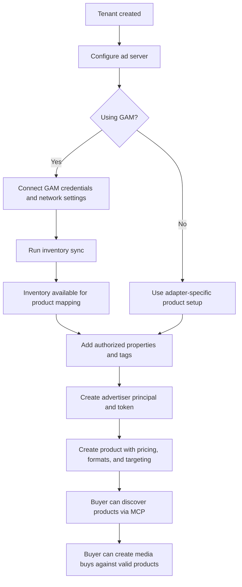

## Flow 1: Publisher Self-Service Signup

Grounded in [public.py](/Users/nicolas.umaras/Documents/GitHub/prebid_salesagent/src/admin/blueprints/public.py) and [auth.py](/Users/nicolas.umaras/Documents/GitHub/prebid_salesagent/src/admin/blueprints/auth.py).

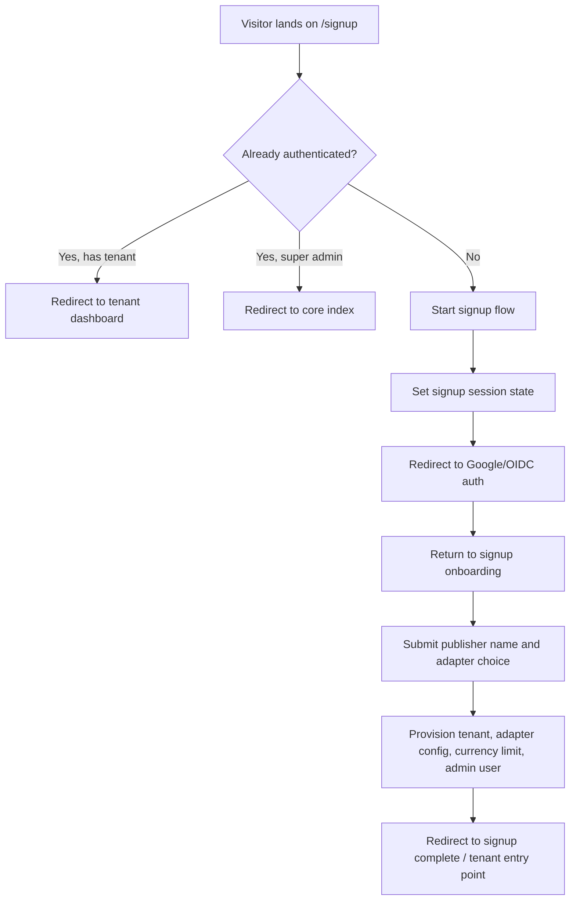

Notes:

- Signup is only allowed on the main domain, not tenant domains.
- Provisioning creates a tenant, adapter config, default budget/currency limits, and an admin user in one flow.

## Flow 2: Admin UI Login and Tenant Access

Grounded in [auth.py](/Users/nicolas.umaras/Documents/GitHub/prebid_salesagent/src/admin/blueprints/auth.py), [app.py](/Users/nicolas.umaras/Documents/GitHub/prebid_salesagent/src/admin/app.py), and [tenants.py](/Users/nicolas.umaras/Documents/GitHub/prebid_salesagent/src/admin/blueprints/tenants.py).

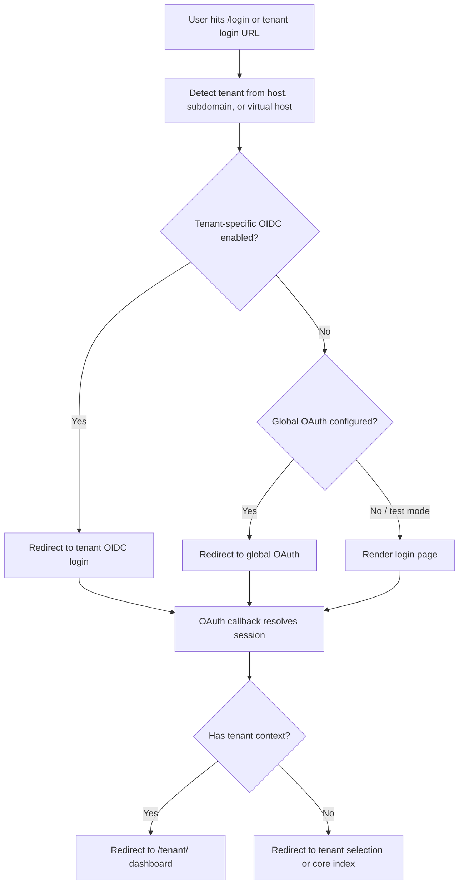

Key destinations after login:

- Tenant dashboard: metrics, recent media buys, setup checklist
- Tenant settings: adapter config, integrations, advertisers, inventory state
- Products and principals: operational setup
- Workflows: approval and audit visibility

## Flow 3: Admin Tenant Setup and Operation

Grounded in [tenants.py](/Users/nicolas.umaras/Documents/GitHub/prebid_salesagent/src/admin/blueprints/tenants.py), [products.py](/Users/nicolas.umaras/Documents/GitHub/prebid_salesagent/src/admin/blueprints/products.py), [principals.py](/Users/nicolas.umaras/Documents/GitHub/prebid_salesagent/src/admin/blueprints/principals.py), and [workflows.py](/Users/nicolas.umaras/Documents/GitHub/prebid_salesagent/src/admin/blueprints/workflows.py).

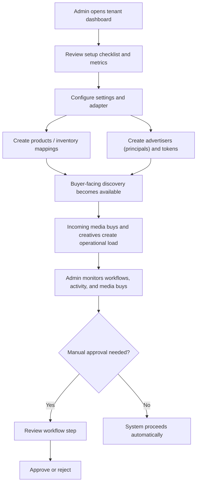

## Flow 3A: Configure Google Ad Manager

Grounded in [gam.py](/Users/nicolas.umaras/Documents/GitHub/prebid_salesagent/src/admin/blueprints/gam.py) and [tenants.py](/Users/nicolas.umaras/Documents/GitHub/prebid_salesagent/src/admin/blueprints/tenants.py).

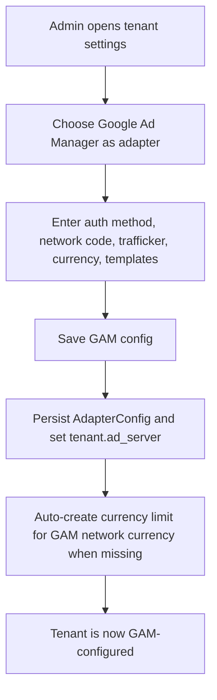

Why it matters:

- Without GAM configuration, inventory sync cannot start.
- Without GAM network and auth data, product mappings to real GAM inventory cannot be validated.

## Flow 3B: Sync GAM Inventory

Grounded in [inventory.py](/Users/nicolas.umaras/Documents/GitHub/prebid_salesagent/src/admin/blueprints/inventory.py), [background_sync_service.py](/Users/nicolas.umaras/Documents/GitHub/prebid_salesagent/src/services/background_sync_service.py), and [gam_inventory_service.py](/Users/nicolas.umaras/Documents/GitHub/prebid_salesagent/src/services/gam_inventory_service.py).

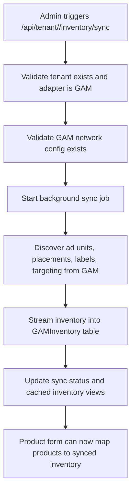

Why it matters:

- GAM product creation can validate ad unit and placement IDs against synced inventory.
- The setup checklist treats inventory sync as a first-class prerequisite for GAM tenants.

## Flow 3C: Add Authorized Properties and Tags

Grounded in [authorized_properties.py](/Users/nicolas.umaras/Documents/GitHub/prebid_salesagent/src/admin/blueprints/authorized_properties.py) and [products.py](/Users/nicolas.umaras/Documents/GitHub/prebid_salesagent/src/admin/blueprints/products.py).

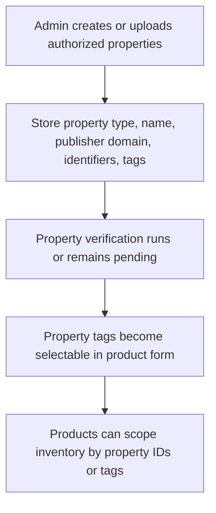

Why it matters:

- Products rely on authorized properties and property tags to define where inventory may be sold.
- Product save paths validate selected tags and property IDs against authorized property records.

## Flow 3D: Create Advertiser Principal and Token

Grounded in [principals.py](/Users/nicolas.umaras/Documents/GitHub/prebid_salesagent/src/admin/blueprints/principals.py).

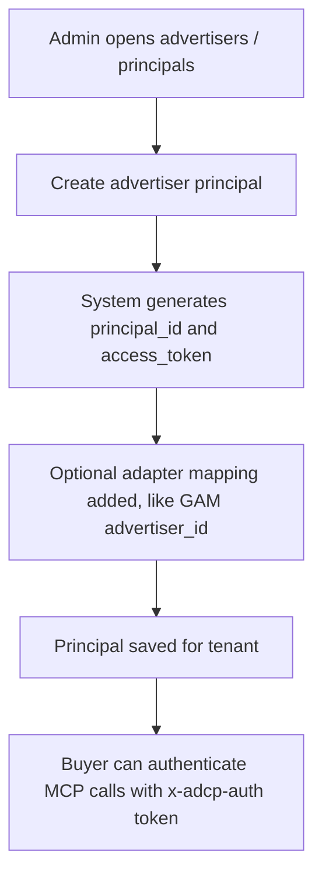

Why it matters:

- No principal means no buyer token.
- No buyer token means transactional MCP calls like `create_media_buy` cannot succeed.

## Flow 3E: Add a Product That MCP Can Sell

Grounded in [products.py](/Users/nicolas.umaras/Documents/GitHub/prebid_salesagent/src/admin/blueprints/products.py).

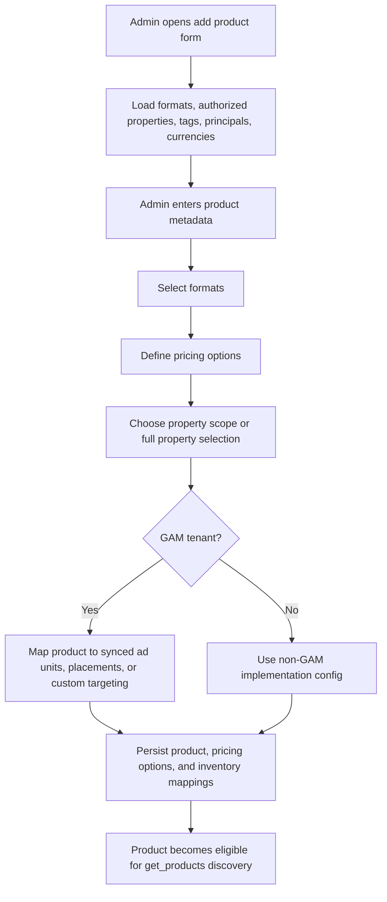

What the product flow enforces:

- Product name is required
- At least one pricing option is required
- Formats are validated against the creative agent when available
- Property IDs and tags are validated against authorized property data
- For GAM, mapped ad units and placements are checked against synced inventory

## Flow 3F: Publisher Readiness to Sell via MCP

This is the full operational readiness flow that turns configuration into sellable inventory.

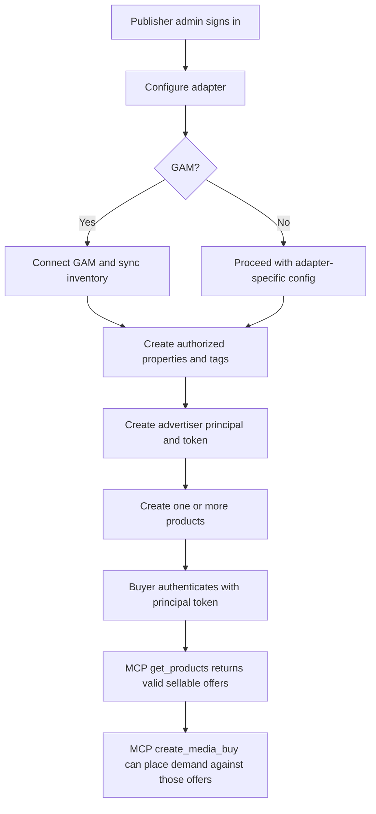

## Flow 4: Buyer Discovery to Media Buy via MCP or REST

Grounded in [main.py](/Users/nicolas.umaras/Documents/GitHub/prebid_salesagent/src/core/main.py), [api_v1.py](/Users/nicolas.umaras/Documents/GitHub/prebid_salesagent/src/routes/api_v1.py), and [test_mcp_tool_roundtrip_minimal.py](/Users/nicolas.umaras/Documents/GitHub/prebid_salesagent/tests/integration/test_mcp_tool_roundtrip_minimal.py).

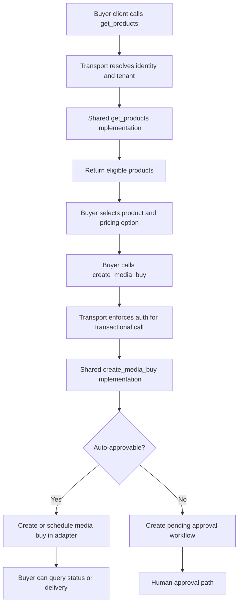

Discovery vs transaction:

- Auth-optional discovery: capabilities, creative formats, authorized properties, and in some cases products
- Auth-required transaction: create media buy, update media buy, get delivery, creative sync/listing

Operational note:

- `get_products` only becomes commercially meaningful after the setup flows above are complete.
- In other words, MCP does not create sellable inventory by itself; it exposes inventory and rules the publisher has already configured in Admin UI.

## Flow 5: Buyer Invocation via A2A

Grounded in [adcp_a2a_server.py](/Users/nicolas.umaras/Documents/GitHub/prebid_salesagent/src/a2a_server/adcp_a2a_server.py), [README.md](/Users/nicolas.umaras/Documents/GitHub/prebid_salesagent/src/a2a_server/README.md), and [test_a2a_endpoints_working.py](/Users/nicolas.umaras/Documents/GitHub/prebid_salesagent/tests/e2e/test_a2a_endpoints_working.py).

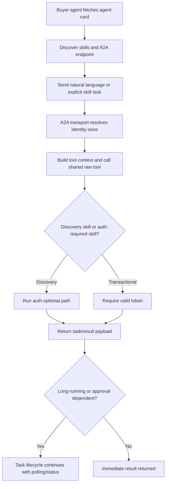

## Flow 6: Human Approval for Pending Media Buys

Grounded in [workflows.py](/Users/nicolas.umaras/Documents/GitHub/prebid_salesagent/src/admin/blueprints/workflows.py).

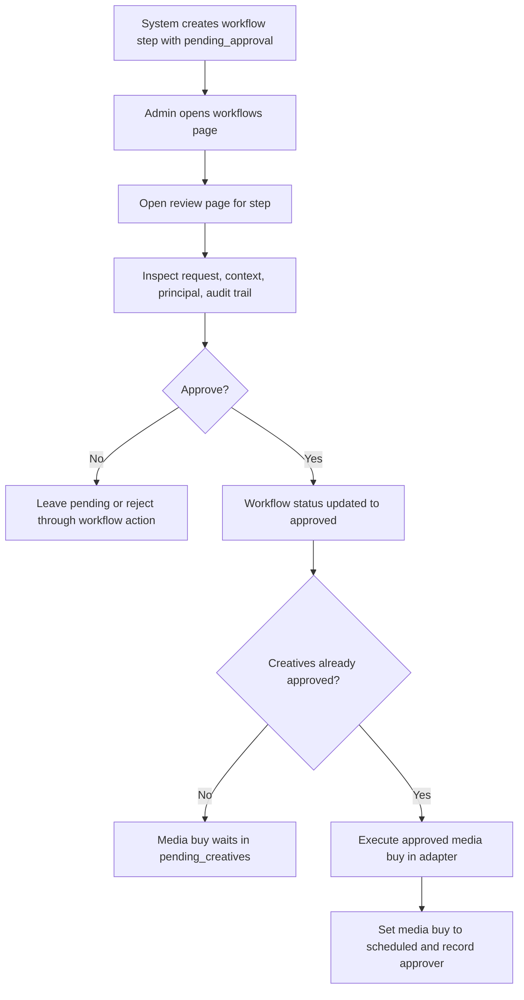

## Cross-Cutting Flow Shape

This is the architectural pattern repeated across MCP, REST, and A2A.

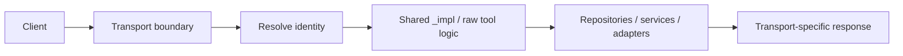

## Suggested Next Cuts

If we want to go deeper, the next useful diagrams would be:

- Creative lifecycle from sync to approval to assignment
- Tenant setup checklist as a state machine
- Admin information architecture by role: super admin vs tenant admin vs advertiser
- End-to-end media buy state machine from draft to active to delivery reporting
